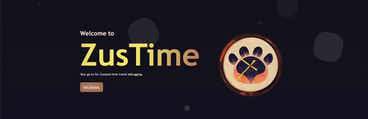
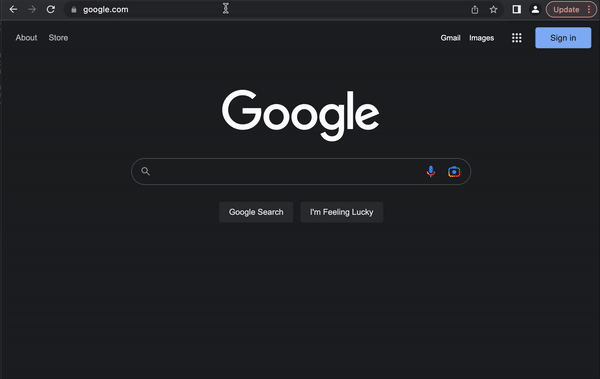
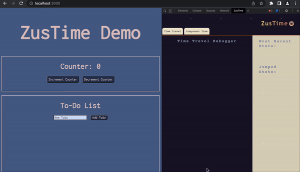
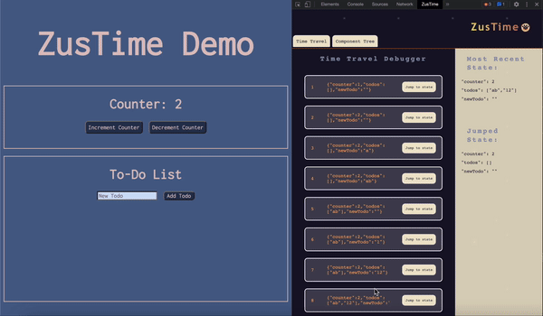

<div align="center">
    
    <h1>Welcome to ZusTime</h1>
    <h2>Zustand's first dedicated time travel debugging tool!</h2>
</div>

## Overview
Hi there and welcome to ZusTime, a Chrome developer tool that can be used with any Zustand application! ZusTime was designed and built with love by four engineers passionate about solving difficult problems and streamlining the debugging process for Zustand developers.

With ZusTime you can inspect your Zustand store and application by stepping both forward and backwards in your code, allowing you to visualize snapshots of state at various points in time. This type of debugging tool limits the need for countless console logs and prevents you from having to run your application over and over again, helping you find those pesky, difficult to reproduce bugs quickly before your application gets to production.

ZusTime also allows the ability to view your React components through the use of our visual component hierarchy tree, making it easier for you to understand and navigate complex React applications. 

## Getting Started
### Adding ZusTime as a Chrome developer tool
As of now, ZusTime has not yet been added to the Chrome Extension store, but it is still quick and easy to setup. 
Please follow the steps below to get started:
1. Clone this repo to your local machine.
2. Open a terminal, navigate to the root directory and run ``` npm run build ```.
3. Open Google Chrome, navigate to `chrome://extensions/`, and make sure the **"Developer mode"** toggle in the top-right corner is siwtched to **on**.
4. Click the **"Load unpacked"** button in the top-left and select the directory `chrome-extension` on your local machine.
5. Congrats! ZusTime will now show up in your Chrome developer tools!

<p align="center">
  
</p>

### Making ZusTime compatible with your application
1. Within your Zustand application, navigate to the file that contains your **store**.
2. Above `export default <your store name>;` add this line of code `(window as any).store = <your store name>;`. This gives ZusTime the ability to capture snapshots of state when changes to your store are made.
3. Adding this line of code allows ZusTime to access your Zustand store via the global window object. This is safe in development mode when you are working on debugging, but would be cosidered a security risk once you launch your application to production. For this reason we highly recommend adding that necessary line of code in `deveopment mode ONLY` and removing it before production.
4. The time travel debugging feature will work with any Zustand Application, however the component hierarchy tree utilizes React Fiber and will only render a tree when **React version 16 or higher** is being used. If you would like to take advantage of the component tree visualizer, please upgrade React to at least `version 16 or higher`.
5. In addition, the component tree will not render your React components if they are nested within a `<div>` or `<span>` so please add components to your app by simply using `<ComponentName />`.

And that's it! You can now run your application in development mode and utilize ZusTime's time travel debugging and component hierarchy tree visulization features!

## Time Travel Debugging with A State Tracker and Visualizer
Once you have your application running in a Chrome browser, open the developer tools by right clicking on the screen and choosing `inspect`, or you can simply press `F12` on your keyboard. Among the panels you should find one with the title **"ZusTime"** and a really cute icon.

<p align="center">
  
</p>

When a change to state is made within your Zustand application, a snapshot of your store is captured and a **Jump to State** button will appear within the ZusTime panel. Whenever your want to "time travel" simply click one of the Jump to State buttons and your application will be reverted to a previous instance of state. In addition, you will be able to view the current state of your Zustand store on the right hand side of the buttons. Pretty neat, huh?

<p align="center">
  
</p>

## React Component Hierarchy Tree Visualizer
To view your component tree, simply click the **Component Tree** tab at the top of the tool and you will immediately see your React components rendered in an interactive tree visualizer thanks to the help of D3.js. Here you are able to toggle the view of parent and children components by simply clicking on each node.

<p align="center">
  
</p>

## Contribute
We created ZusTime with the intention of further expanding upon and improveing this tool for years to come.

That's where the help of our amazing community comes in! If you have an idea that might make ZusTime better we always encourage contributions. Simply follow the steps below to submit the changes you would make.

- Fork this ZusTime repo
- Clone the repository to your local machine with the command `git clone <code link from ZusTime fork>`
- Create your own Feature Branch with the command `git checkout -b <yourFeatureName>`
- Add your changes with the command `git add .`
- Stage and commit your changes with the command `git commit -m "<your comment>"`
- Merge your branch with the dev branch locally with the command `git merge dev`
- Resolve any merge conflicts
- Push up your branch with the command `git push origin <your feature branch name>`
- Open a pull request
- A member of our team will then review any pull requests and merge them to the main branch if appropriate

## Meet the ZusTime Team
- Kelsey Graner • [LinkedIn](https://www.linkedin.com/in/kelseygraner/) • [Github](https://github.com/kels-graner)
- Jackqueline Nguyen • [LinkedIn](https://www.linkedin.com/in/jackquelinenguyen/) • [Github](https://github.com/jackquelinenguyen)
- Samantha Warrick • [LinkedIn](https://www.linkedin.com/in/samantha-warrick/) • [Github](https://github.com/samanthawarrick)
- Sylvia Thong • [LinkedIn](https://www.linkedin.com/in/sylviathong/) • [Github](https://github.com/sylvia45335)

## Support
If you love ZusTime please throw a :star2: our way! 

## License
ZusTime is developed under the [MIT license](https://github.com/open-source-labs/ZusTime/LICENSE).

